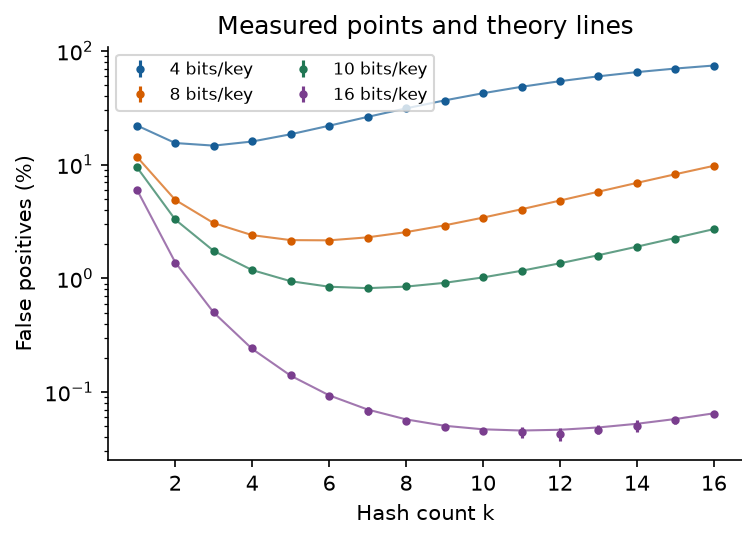
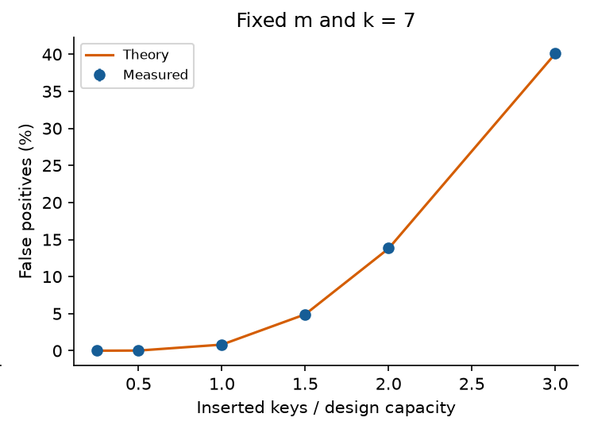

# Bloom filters in practice

## 1 What I built

This project implements an insertion-only Bloom filter in C++17, using explicit unsigned arithmetic and bit operations. A query returns either definitely absent or possibly present.

Keys are unsigned 64-bit integers, keeping string encoding and variable-length hashing outside the study. A vector packs the bit markers into 64-bit words for compact storage. The bit count m, hash count k and seed are fixed at construction. Deletion and resizing are not supported.

The textbook model assumes independent hashes. This implementation uses the SplitMix64 finalizer and constants from Vigna [3]. Each position combines the key with a salt (an extra mixing value) based on the seed and hash number, then reduces the mixed result modulo m. The mapping is repeatable and non-cryptographic; different salts do not establish independence.

The standard contains method stops at the first zero bit. The added contains_full_scan checks all k positions. Both read the same stored bits and return the same answer, allowing their query times to be compared.

| Location | Purpose |
| --- | --- |
| include/bloom.hpp | Packed storage, hashing and membership |
| src/study.cpp | Data generation, baselines and measurements |
| tests/test_bloom.cpp | Deterministic and randomized checks |
| src/pipeline_exit.cpp | Paired exact-pipeline follow-up |
| scripts/analyze*.py | Validation, summaries and plots |

## 1.1 Implementation details and correctness

The invariant is that every bit needed by an inserted key stays set. All bits start at zero. Insertion uses bitwise OR to set the key’s k positions without clearing existing bits. Lookup checks the same positions with the same settings. Therefore, an inserted key always returns true. This guarantee holds even if the hashes are not independent.

For a bit position p in the array, p / 64 selects the word and p % 64 selects the bit inside it. UINT64_C(1) provides an unsigned constant wide enough to shift to any bit in a word. The offset stays between 0 and 63. The allocation rounds up to whole words and avoids adding 63 to bits, which could overflow for a very large input.

The demo uses m = 64, k = 3 and seed = 7, then inserts 10, 20 and 30. Key 10 uses positions 30, 14 and 16. Key 37 also returns true although it was never inserted: this is a false positive. A separate, deliberately broken example replaces |= with =. This clears earlier bits in the word and causes an inserted key to return false.

The tests pass 464,427 checks in both the optimised build and the AddressSanitizer/UndefinedBehaviorSanitizer build. They cover empty filters, invalid settings, repeated insertions, keys 0 and UINT64_MAX, word boundaries and full filters. They also check that both query versions agree and that the filter followed by an exact set gives the correct answer for each tested key. The accuracy experiment checks another 11,560,000 inserted-key lookups with no false negatives.

## 2 Empirical study

### 2.1 Main question and theoretical prediction

The main question is how closely measured false-positive rates follow theory as the hash count and inserted-key count change. Here, n counts distinct inserted keys, m is the array size in bits, and k is the number of hash positions per key.

The hypothesis is that measured rates follow the predicted curve: increasing k first lowers and then raises the rate, while adding keys to a fixed filter raises it. Checking that inserted keys are never rejected tests implementation correctness.

With independent, uniform hashes, a particular bit stays zero with probability:

$$
{P}_{\mathrm{zero}} = {\left(1 - \frac{1}{m}\right)}^{kn}
$$

The usual approximation for the false-positive rate p is [1, 2]:

$$
p \approx  {\left(1 - {e}^{-\frac{kn}{m}}\right)}^{k}
$$

This assumes approximately independent queried bits. Let b be bits per inserted key and k* the hash count that minimises the approximation:

$$
b = \frac{m}{n} ,     {k}^{*} \approx  b ln 2
$$

At 10 bits per key, k* is about 6.93. A follow-up asks whether the lowest-error choice also gives the fastest exact lookup.

| Experiment | Controlled design |
| --- | --- |
| Hash sweep | n = 20,000; b ∈ {4, 8, 10, 16}; k = 1…16 |
| Capacity | m = 200,000; k = 7; n = 5,000…60,000 |
| Exact lookup | n ∈ {20,000, 200,000}; b = 10; k ∈ {1, 3, 7, 11} |

## 2.2 Reproducible measurement

Each accuracy setting uses eight seeds and 200,000 absent queries. Applying the one-to-one mix64 mapping to separate counter ranges keeps inserted and absent keys distinct. Seeds change the ranges and salts; comparisons within a seed reuse keys. The 560 rows record 112 million query evaluations.

Timing uses four seeds, seven repetitions and 200,000 queries per repetition. Present keys are sampled with replacement; absent keys are distinct. Queries are shuffled. The methods are std::unordered_set alone, Bloom alone, and Bloom followed by the set for possible matches. This last method is the exact pipeline: the set verifies matches, keeping the final answer exact.

Only lookup is timed. Generation, allocation, construction, validation and printing are excluded. Methods are warmed up and randomly ordered in each repetition. Counts are checked and added to an observable accumulator so the compiler cannot discard the queries. The set uses mix64, reserves space for n keys and has maximum load factor 1.0.

For each seed, the analysis takes the median of seven timings, then reports the mean of the four medians and a two-sided Student t 95% interval. Speedup is calculated within each seed before averaging. Accuracy intervals use eight seed-level rates [4]. Repetitions are not independent samples. The intervals describe seed variation, not all machine or workload uncertainty.

## 2.3 Accuracy and hash count

| Bits per key | Measured best k | False-positive rate |
| --- | --- | --- |
| 4 | 3 | 14.712% |
| 8 | 6 | 2.144% |
| 10 | 7 | 0.821% |
| 16 | 12 | 0.043% |

At 10 bits per key, k = 7 gives a false-positive rate of 0.821 ± 0.016 percentage points, close to the predicted 0.819%. Raising k to 16 increases the measured rate to 2.714%. More hashes make a query check more positions, but they also set more bits during insertion. When the array becomes too full, the extra checks no longer reduce false positives.

At 16 bits per key, k = 12 has the lowest measured mean, while the rounded theoretical choice is 11. The confidence intervals for nearby choices overlap, so the result does not clearly show that 12 is better. Random variation can change which setting has the smallest measured value.

## 2.4 Capacity and storage

| Inserted / design capacity | Measured false-positive rate |
| --- | --- |
| 0.5× | 0.019% |
| 1× | 0.821% |
| 1.5× | 4.875% |
| 2× | 13.841% |
| 3× | 40.182% |

With m = 200,000 and k = 7, the filter was designed for 20,000 keys. At twice that capacity, false positives rise from 0.821% to 13.841%; at three times capacity, they reach 40.182%. Inserted keys still pass, but the fuller array rejects fewer absent keys.

Together, the hash-count and capacity curves broadly follow theory. At one quarter of capacity, however, only three false positives occurred in 1.6 million absent queries, too few to estimate this small probability precisely.

### Storage comparison

| Structure at n = 200,000 | Requested storage |
| --- | --- |
| Bloom bit array | 250,000 bytes |
| Exact set nodes and buckets | 6,400,024 bytes |
| Bloom plus exact set | 6,650,024 bytes |

The exact set uses about 25.6 times the storage of the filter, but gives exact answers. Adding the filter to the set costs another 250,000 bytes, or 3.9%. Measurements count requested set-node and bucket bytes and the filter’s word array. They exclude object headers, allocator metadata and input vectors, rather than measuring total process memory.

## 2.5 Does lower error mean faster lookup?

| n = 200,000 | k = 1 speedup | k = 7 speedup |
| --- | --- | --- |
| 0% absent | 0.736 ± 0.061 | 0.385 ± 0.014 |
| 50% absent | 0.947 ± 0.010 | 0.727 ± 0.010 |
| 90% absent | 1.557 ± 0.069 | 0.680 ± 0.009 |
| 100% absent | 2.709 ± 0.062 | 0.905 ± 0.440 |

The follow-up compares the low-error choice with faster-to-check settings. Seven hashes did not consistently make exact lookup faster. With 20,000 keys and all queries absent, its speedup was 0.713 ± 0.021, meaning it was slower than the set alone. One hash gave 2.871 ± 0.357. Although it allowed more false positives, it took less time to check and still rejected most absent keys.

With 200,000 keys and all queries absent, the interval for k = 7 includes 1, so this run does not clearly show a speed advantage. When all queried keys were present, adding the filter always made lookup slower because every query still reached the set. The benefit depends on the proportion of absent queries and the cost of checking the set.

## 2.6 A follow-up on early exit

The timing study raised an unexpected question: why did absent queries take longer even though they could stop early? A diagnostic compared early exit with full scanning using a separate array with identical bits and positions. It used four seeds and seven repetitions; bit checks were counted outside timing.

With n = 200,000, early exit checked about 1.996 positions per absent query and took 41.69 ± 1.96 ns. Full scanning checked all seven positions but took only 23.58 ± 0.50 ns. The smaller dataset showed the same pattern. In these tests, checking fewer bits did not make the query faster.

This suggested that fewer bit checks did not guarantee lower runtime. Branches and compiler output are possible explanations, but no hardware counters or assembly analysis were collected. Because the arrays had different addresses, the next comparison uses the same Bloom object and measures the complete lookup process. The two runs remain separate.

## 2.7 Full scanning in the exact pipeline

This section compares two complete exact-query pipelines. In both pipelines, the Bloom filter first rejects keys that are definitely absent, and the exact set checks every possible match so the final answer remains exact. The difference is only in the Bloom query: contains stops at the first zero bit, while contains_full_scan checks all k positions before returning.

The final timing check uses the same Bloom object and exact set for both versions. It tests two set sizes, k = 1 or 7, four query mixes and four seeds, with seven repetitions of 200,000 queries. The timing and analysis procedure follows Section 2.2, giving 1,344 rows.

With all queries absent, full scanning is 1.812 ± 0.034 times as fast as early exit. It also beats the set alone at both sizes. At 50% absent, however, its speed relative to early exit is 0.859 ± 0.006, so it is slower. At 90% absent, its interval relative to the set includes 1.

One hash still gives the fastest tested all-absent lookup: its speedup at 200,000 keys is 2.726 ± 0.055. Thus, improving the seven-hash code does not change the answer to the follow-up question: lowest error does not imply fastest lookup. The one-hash control shows much smaller differences between query versions, but these measurements do not identify a hardware cause. Configuration order was fixed on an active desktop.

## 2.8 Interpretation and limits

The experiments show that a Bloom filter helps only when it prevents enough exact-set lookups to repay its own checking cost. To make that trade-off explicit, let q be the fraction of queries for absent keys and p the false-positive rate. The fraction r that still reaches the exact set is approximately:

$$
r \approx  (1 - q) + qp
$$

All present keys and false positives still require a set lookup, while true negatives are rejected by the filter. Let L be the extra cost of one exact-set lookup, and let T denote average time per input query. The subscripts identify set-only lookup and Bloom followed by the set. Adding rL to the filtered pipeline gives the cost model below:

$$
{T}_{\mathrm{set}}(L) = {T}_{\mathrm{set}}(0) + L ,     {T}_{\mathrm{filtered}}(L) = {T}_{\mathrm{filtered}}(0) + rL
$$

For r < 1, the extra cost L* at which both methods take equal time is:

$$
{L}^{*} = \frac{{T}_{\mathrm{filtered}}(0) - {T}_{\mathrm{set}}(0)}{1 - r}
$$

For 20,000 keys, seven hashes and all queries absent, the original paired timings give break-even costs of 11.18–12.17 ns across seeds. The model assumes equal extra cost per set lookup. Real databases may differ because of caching, batching, concurrency and different costs for hits and misses.

Both runs used an Apple M2 with 8 GB memory, macOS 14.4.1 and Apple Clang 15 with -O3. Processor assignment, power state and background activity were uncontrolled. Tests cover warmed-up queries, two set sizes and uniform integer keys, excluding cold storage, skewed queries and adversarial inputs. Data generation and filtering share the same mixer family.

Construction is excluded from query speedups. Each set-build time is one observation repeated across the relevant k rows in the memory CSV. The comparison concerns repeated lookups after construction.

## 2.9 Choosing a configuration

The main study supports using the theoretical curve to choose a starting configuration for accuracy. The timing follow-up shows why that choice also needs measurement when speed matters. If false positives are acceptable, select m and k for the error target. If answers must be exact, keep the set and measure the combined query time. In that case, the filter uses extra memory to avoid some set lookups.

| Goal or workload | Recommendation within tested scope |
| --- | --- |
| About 1% false positives at 10 bits/key | Use about 7 hashes at design capacity. Check how full the array becomes as more keys are inserted. |
| Faster exact lookup with 90–100% absent queries | Test fewer hashes first. In the follow-up, k = 1 was faster than k = 7. |
| All queries present | Use the set directly for these tested workloads. The filter did not avoid any set lookups. |
| k = 7 required, all queries absent | Test full scanning. It improved exact lookup at both tested set sizes. |
| Mixed queries or another backend | Compare both versions with the set alone. Early exit was faster than full scanning at 50% absent. |

These recommendations apply to the tested C++17 code and integer queries. A more expensive exact lookup may make stronger filtering worthwhile. Changes in capacity, query distribution, compiler or machine need new measurements. Alternative mixer constants were not compared, so the study does not establish that the chosen constants are best.

## 3 What I learned

### 3.1 The objective determines the parameter

I used to think that adding a Bloom filter would usually speed up an exact lookup. That was too simple. With k = 1 and 200,000 keys, the speedup was only 0.947 when half of the queries were absent, so the filter made the lookup slightly slower. Once the absent-query proportion increased to 90%, the speedup became 1.557, and it reached 2.709 when every query was absent. The filter helped because it could reject enough missing keys before they reached the exact set. This also explains why the number of hashes matters: using more hashes can reduce false positives, but it also makes every query more expensive.

### 3.2 Fewer operations can still take longer

At first, early exit seemed obviously better. It stops at the first zero bit, and in the experiment it checked about two positions per absent query instead of all seven. Surprisingly, full scanning was faster when all queries were absent. I had been treating the number of checks as if it directly represented running time. The experiment changed that view. Branches, compiler output and hardware effects can matter as much as the number of logical operations, so the complete workload still needs to be measured.

### 3.3 Correctness and usefulness are separate

I was initially worried that putting too many keys into the filter could make an inserted key fail a query. That did not happen. Even at three times the design capacity, the filter still had no false negatives. What changed was its ability to reject absent keys: the false-positive rate rose to 40.182%. The filter was still correct, but it was no longer very effective. This taught me that the expected number of keys should be estimated before choosing the size of the filter, with room left for future growth.

## 3.4 Evidence changed the way results were judged

The memory comparison taught me to check what each structure provides. The filter used 250,000 bytes and the exact set used 6,400,024 bytes, but they offered different answer guarantees. Keeping the exact set to check possible matches increased total storage. The small filter only replaces the set when false positives are acceptable.

The hash-count results also showed why I should consider uncertainty. At 16 bits per key, 12 hashes had the lowest measured error rate, but nearby settings had overlapping intervals. I cannot conclude that 12 is truly better from that minimum alone. The full curve gives a clearer picture than naming one setting as the winner.

Finally, many passing checks are not enough if the test repeats the same mistake as the implementation. The first reference bit array reused position(), so it could detect storage errors but miss an error in position(). Review added fixed expected values and checked the exact pipeline against the set for each key. Those checks strengthen correctness evidence, while hash distribution still needs separate evaluation.

## 4 AI use

I used OpenAI Codex for most of the code and report, including implementation, debugging, tests, experiment design, running measurements, analysis and drafting. It also adapted the Word template and uploaded the repository. The September 22 revision used Codex to add full scanning, compare the two exact pipelines and update the recommendations.

One problem was that the first generated reference test reused BloomFilter::position. If that function was wrong, the test could repeat the same error. AI-assisted review added fixed expected mixer outputs and positions, plus checks that the exact pipeline and set agreed on each key. Commit 93063ae contains the initial version, and the test diff records the changes.

Another problem was that the generated analysis script assumed SciPy and Matplotlib were installed. It failed with ModuleNotFoundError for scipy and then matplotlib. The fix replaced the SciPy dependency with explicit t critical values for the supported seed counts and installed the plotting dependencies locally. The commands and successful output were recorded; the raw measurements stayed unchanged.

Codex ran the builds, tests, sanitizers, CSV checks and plot generation. I worked through the bit indexing, insertion invariant and query logic during code review. I relied on the published mixer constants rather than deriving them. Hash independence and the hardware cause of the timing results remain unproven. The |= to = example was deliberately written to show a failure, rather than being an accidental AI bug.

## References

[1] Bloom, B. H. (1970). Space/time trade-offs in hash coding with allowable errors. Communications of the ACM, 13(7), 422–426. https://doi.org/10.1145/362686.362692

[2] Kirsch, A., Mitzenmacher, M., and Varghese, G. Hash-based techniques for high-speed packet processing. Author manuscript. https://www.eecs.harvard.edu/~michaelm/postscripts/dimacs-chapter-08.pdf

[3] Vigna, S. (2015). splitmix64.c. Public-domain reference implementation. https://prng.di.unimi.it/splitmix64.c

[4] NIST/SEMATECH. e-Handbook of Statistical Methods, section 1.3.6.7.2: Critical values of the Student’s t distribution. https://www.itl.nist.gov/div898/handbook/eda/section3/eda3672.htm

### Reproduction record

Repository: https://github.com/mojitote/41052-a1-bloom-filter-study. Main data: results/full-20260910/. Follow-up data: results/early-exit-20260910.csv. New exact-pipeline data: results/pipeline-exit-20260922.csv; analysis: scripts/analyze_pipeline.py. Original environment: results/environment.json; revision metadata: results/upgrade-environment-20260922.json. Exact commands and dependency setup: README.md. Numerical tables and figure source: figures/ and scripts/analyze.py. All external sources accessed on 10 September 2026.
