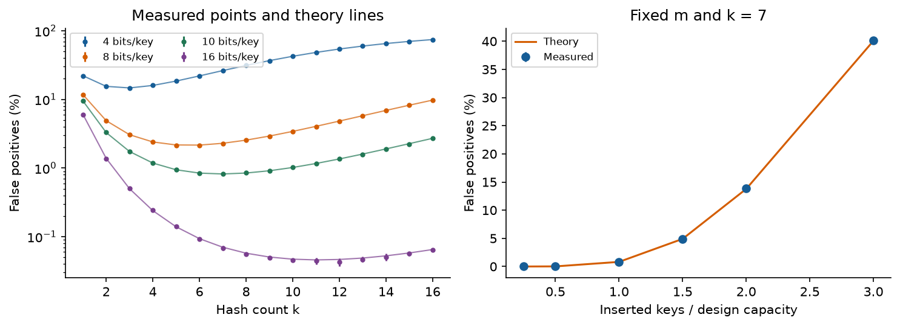
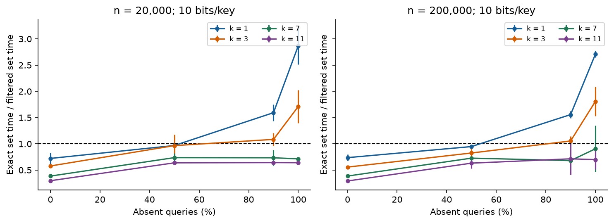
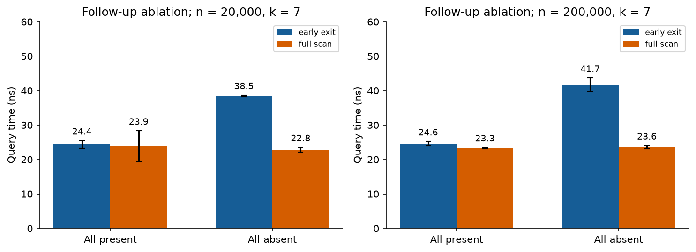
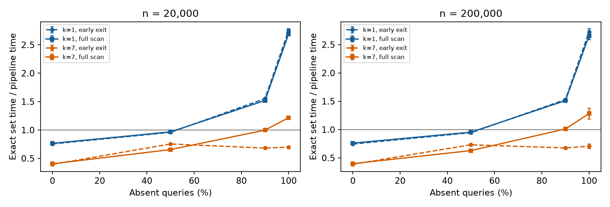

# Bloom filters in practice

## 1 What I built

This project uses C++17 to implement a Bloom filter that supports insertion and lookup. The experiments compare its error rate, memory use and query time. The main finding is that fewer false positives do not always mean faster queries. With many queries for missing keys, using one hash was faster than using seven, even though seven gave a lower error rate.

The filter takes unsigned 64-bit keys as input and stores their bit markers in an array of 64-bit words. Its settings are the number of bits m, the number of hashes k and a seed. insert sets the markers; contains returns false for definitely absent and true for possibly present. The implementation does not support deletion, resizing, saving to disk or concurrent updates.

To calculate each position, the code mixes the key with a salt that depends on the seed and hash number, then takes the result modulo m. It uses the SplitMix64 finalizer and constants from Vigna [3]. This is a deterministic, non-cryptographic hash. Using different salts does not prove that the hash positions are independent.

| Location | Purpose |
| --- | --- |
| include/bloom.hpp | Packed storage, hashing and membership |
| src/study.cpp | Data generation, baselines and measurements |
| tests/test_bloom.cpp | Deterministic and randomized checks |
| src/pipeline_exit.cpp | Paired exact-pipeline follow-up |
| scripts/analyze*.py | Validation, summaries and plots |

## 1.1 Correctness and the difficult step

The invariant is that every bit needed by an inserted key stays set. All bits start at zero. Insertion uses bitwise OR to set the key’s k positions without clearing existing bits. Lookup checks the same positions with the same settings. Therefore, an inserted key always returns true. This guarantee holds even if the hashes are not independent.

For a position p, p / 64 selects the word and p % 64 selects the bit inside it. UINT64_C(1) provides an unsigned constant wide enough to shift to any bit in a word. The offset stays between 0 and 63. The allocation rounds up to whole words and avoids adding 63 to bits, which could overflow for a very large input.

The demo uses m = 64, k = 3 and seed = 7, then inserts 10, 20 and 30. Key 10 uses positions 30, 14 and 16. Key 37 also returns true although it was never inserted: this is a false positive. A separate, deliberately broken example replaces |= with =. This clears earlier bits in the word and causes an inserted key to return false.

The tests pass 464,427 checks in both the optimised build and the AddressSanitizer/UndefinedBehaviorSanitizer build. They cover empty filters, invalid settings, repeated insertions, keys 0 and UINT64_MAX, word boundaries and full filters. They also check that both query versions agree and that the filter followed by an exact set gives the correct answer for each tested key. The accuracy experiment checks another 11,560,000 inserted-key lookups with no false negatives.

## 2 Empirical study

### 2.1 Questions and initial hypotheses

The study began with three hypotheses. H1: with a fixed number of bits per key, increasing k should first lower the false-positive rate and then raise it, following the theoretical curve. H2: inserting more keys than the filter was designed for should increase false positives without causing false negatives. H3: filtering before an exact lookup should help when it rejects enough missing keys to save more time than the filter takes.

For n distinct keys in m bits, independent uniform hashing gives a probability of (1 − 1/m)^(kn) that a bit stays zero. The usual approximation for the false-positive rate is p ≈ (1 − exp(−kn/m))^k [1, 2]. It treats the queried bit values as approximately independent, so it predicts the rate rather than giving an exact value for this implementation.

Let b = m/n be the average bit budget per key. The hash count that minimises the approximate false-positive rate is k* ≈ b ln 2. With b = 10, this gives k* ≈ 6.93, so seven hashes are a reasonable choice for accuracy. The formula does not include the time spent calculating and checking those hashes.

| Experiment | Controlled design |
| --- | --- |
| Hash sweep | n = 20,000; b ∈ {4, 8, 10, 16}; k = 1…16 |
| Capacity | m = 200,000; k = 7; n = 5,000…60,000 |
| Exact lookup | n ∈ {20,000, 200,000}; b = 10; k ∈ {1, 3, 7, 11} |
| Query mix | Absent fractions 0%, 50%, 90%, 100% |

## 2.2 Reproducible measurement

Each accuracy setting uses eight seeds and 200,000 absent queries. Applying the one-to-one mix64 mapping to separate counter ranges keeps inserted and absent keys distinct. Seeds change the ranges and salts; comparisons within a seed reuse keys. The 560 rows record 112 million query evaluations.

Timing uses four seeds, seven repetitions and 200,000 queries per repetition. Present keys are sampled with replacement; absent keys are distinct. Queries are shuffled. The methods are std::unordered_set alone, Bloom alone, and Bloom followed by the set for possible matches. This last method is the exact pipeline: the set verifies matches, keeping the final answer exact.

Only lookup is timed. Generation, allocation, construction, validation and printing are excluded. Methods are warmed up and randomly ordered in each repetition. Counts are checked and added to an observable accumulator so the compiler cannot discard the queries. The set uses mix64, reserves space for n keys and has maximum load factor 1.0.

For each seed, the analysis takes the median of seven timings, then reports the mean of the four medians and a two-sided Student t 95% interval. Speedup is calculated within each seed before averaging. Accuracy intervals use eight seed-level rates [4]. Repetitions are not independent samples. The intervals describe seed variation, not all machine or workload uncertainty.

## 2.3 Accuracy and hash count

| Bits per key | Measured best k | FPR at that k |
| --- | --- | --- |
| 4 | 3 | 14.712% |
| 8 | 6 | 2.144% |
| 10 | 7 | 0.821% |
| 16 | 12 | 0.043% |

At 10 bits per key, k = 7 gives a false-positive rate of 0.821 ± 0.016 percentage points, close to the predicted 0.819%. Raising k to 16 increases the measured rate to 2.714%. More hashes make a query check more positions, but they also set more bits during insertion. When the array becomes too full, the extra checks no longer reduce false positives.

At 16 bits per key, k = 12 has the lowest measured mean, while the rounded theoretical choice is 11. The confidence intervals for nearby choices overlap, so the result does not clearly show that 12 is better. Random variation can change which setting has the smallest measured value.

## 2.4 Capacity and storage

| Inserted / design capacity | Measured false-positive rate |
| --- | --- |
| 0.5× | 0.019% |
| 1× | 0.821% |
| 1.5× | 4.875% |
| 2× | 13.841% |
| 3× | 40.182% |

With m = 200,000 and k = 7, the filter was designed for 20,000 keys. At twice that capacity, false positives rise from 0.821% to 13.841%; at three times capacity, they reach 40.182%. Inserted keys still pass, but the fuller array rejects fewer absent keys.

At one quarter of capacity, only three false positives occurred in 1.6 million absent queries. There are too few errors to estimate this small probability precisely.

| Structure at n = 200,000 | Requested storage |
| --- | --- |
| Bloom bit array | 250,000 bytes |
| Exact set nodes and buckets | 6,400,024 bytes |
| Bloom plus exact set | 6,650,024 bytes |

The exact set uses about 25.6 times the storage of the filter, but gives exact answers. Adding the filter to the set costs another 250,000 bytes, or 3.9%. Measurements count requested set-node and bucket bytes and the filter’s word array. They exclude object headers, allocator metadata and input vectors, rather than measuring total process memory.

## 2.5 Exact lookup performance

| n = 200,000 | k = 1 speedup | k = 7 speedup |
| --- | --- | --- |
| 0% absent | 0.736 ± 0.061 | 0.385 ± 0.014 |
| 50% absent | 0.947 ± 0.010 | 0.727 ± 0.010 |
| 90% absent | 1.557 ± 0.069 | 0.680 ± 0.009 |
| 100% absent | 2.709 ± 0.062 | 0.905 ± 0.440 |

Seven hashes gave a low error rate but did not consistently make exact lookup faster. With 20,000 keys and all queries absent, its speedup was 0.713 ± 0.021, meaning it was slower than the set alone. One hash gave 2.871 ± 0.357. Although it allowed more false positives, it took less time to check and still rejected most absent keys.

With 200,000 keys and all queries absent, the interval for k = 7 includes 1, so this run does not clearly show a speed advantage. When all queried keys were present, adding the filter always made lookup slower because every query still reached the set. The benefit depends on the proportion of absent queries and the cost of checking the set.

## 2.6 A follow-up on early exit

In the main experiment, Bloom queries for absent keys took longer than queries for present keys, even though they could stop early. A separate experiment compared early exit with a version that checks all k positions, called a full scan. The full scan used a separate word array with the same contents and positions. Each setting used four seeds and seven timed repetitions. Bit checks were counted outside timing.

With n = 200,000, early exit checked about 1.996 positions per absent query and took 41.69 ± 1.96 ns. Full scanning checked all seven positions but took only 23.58 ± 0.50 ns. The smaller dataset showed the same pattern. In these tests, checking fewer bits did not make the query faster.

Branches and compiler-generated code may explain the difference, but no branch counters or assembly analysis were collected. The two arrays also had different memory addresses. The next experiment removes that storage difference and compares both versions as part of exact lookup. Its timings are reported separately from this run.

## 2.7 Full scanning in the exact pipeline

The next experiment uses contains and contains_full_scan on the same Bloom object, followed by the same exact set. Both versions read the same bits and send the same queries to the set. Full scanning uses &= to combine all bit checks without an early return. Before timing, both versions are checked against the exact set for every query.

The experiment uses two set sizes, k = 1 or 7, four absent-query proportions and four seeds. Each method has seven repetitions of 200,000 queries, giving 1,344 timing rows. Data generation and validation stay outside timing. Methods are warmed up and run in random order. Analysis uses the same seed-median and paired-ratio method as before. With k = 1, both query versions check just one bit, providing a useful control.

| n = 200,000; k = 7 | Set / early time | Set / full time |
| --- | --- | --- |
| 50% absent | 0.732 ± 0.006 | 0.629 ± 0.004 |
| 90% absent | 0.676 ± 0.016 | 1.011 ± 0.028 |
| 100% absent | 0.707 ± 0.041 | 1.282 ± 0.098 |

## 2.7.1 Results and scope

With 200,000 keys, k = 7 and all queries absent, full scanning makes the exact pipeline 1.812 ± 0.034 times as fast as early exit. Compared with the set alone, the speedup is 1.282 ± 0.098 for full scanning and 0.707 ± 0.041 for early exit. Full scanning therefore improves the whole lookup process in this setting, not only the filter by itself.

The result changes with the queries. When half are absent, the full-scan/early-exit speed ratio is 0.859 ± 0.006, so full scanning is slower. With 90% absent queries, its speedup over the set alone is 1.011 ± 0.028. That interval includes 1, so there is no clear advantage over the set in this case.

For the smaller set, full scanning with k = 7 also helps when all queries are absent: its speedup over the set alone is 1.217 ± 0.009. However, one hash with early exit remains faster in the 200,000-key, all-absent test, with a speedup of 2.726 ± 0.055. Improving the seven-hash version does not make it the fastest tested setting.

Using one Bloom object removes the different array addresses from the earlier comparison. With k = 1, the timing differences between versions are much smaller than with k = 7 when most queries are absent. However, the experiment does not separate the effects of branches, vectorisation or instruction scheduling. It uses four seeds, a fixed order of configurations and an active desktop machine.

## 2.8 Interpretation and limits

Let q be the fraction of queries for absent keys and p the false-positive rate. The fraction reaching the exact set is approximately r = (1 − q) + qp: all present keys and the false positives need an exact check. If each set lookup costs an extra L, then Tset(L) = Tset(0) + L and Tfiltered(L) = Tfiltered(0) + rL. For r < 1, the extra cost at which the methods take equal time is L* = (Tfiltered(0) − Tset(0))/(1 − r).

For n = 20,000, k = 7 and all queries absent, the original paired timings give L* values between 11.18 and 12.17 ns across seeds. This estimates how much extra lookup cost would make filtering worthwhile. It assumes the same extra cost for every set lookup; real databases or networks may behave differently because of caching, batching, concurrency and different costs for hits and misses.

Both runs used an Apple M2 with 8 GB memory, macOS 14.4.1 and Apple Clang 15, compiling C++17 with -O3. CPU affinity, power state and background activity were not controlled. The tests use warmed-up queries, two set sizes and uniform integer keys. They do not cover cold storage, skewed queries or adversarial inputs. Data generation and filtering also share the same mixer family.

Construction was measured separately and is excluded from query speedups. Each set-build time is one observation copied across the relevant k rows in the memory CSV, not a new measurement in each row. The performance comparison therefore concerns repeated lookups after the structures have been built.

## 2.9 Choosing a configuration

Choose the setting based on the answer guarantee and the work it needs to save. If false positives are acceptable, select m and k for the error target. If answers must be exact, keep the set and measure the combined query time. In that case, the filter uses extra memory to avoid some set lookups.

| Goal or workload | Recommendation within tested scope |
| --- | --- |
| About 1% false positives at 10 bits/key | Use about 7 hashes at design capacity. Check how full the array becomes as more keys are inserted. |
| Faster exact lookup with 90–100% absent queries | Test fewer hashes first. In the follow-up, k = 1 was faster than k = 7. |
| All queries present | Use the set directly for these tested workloads. The filter did not avoid any set lookups. |
| k = 7 required, all queries absent | Test full scanning. It improved exact lookup at both tested set sizes. |
| Mixed queries or another backend | Compare both versions with the set alone. Early exit was faster than full scanning at 50% absent. |

These recommendations apply to the tested C++17 code and integer queries. A more expensive exact lookup may make stronger filtering worthwhile. Changes in capacity, query distribution, compiler or machine need new measurements. Alternative mixer constants were not compared, so the study does not establish that the chosen constants are best.

## 3 What I learned

### 3.1 The objective determines the parameter

I learned to separate low error from fast exact lookup. Seven hashes gave 0.821% false positives, compared with 9.502% for one hash. However, with 200,000 keys and all queries absent, the one-hash exact pipeline was about 2.71 times as fast as the set alone. The original seven-hash early-exit version showed no clear speed advantage. Extra filtering is useful only when the lookups it avoids save enough time to pay for it.

### 3.2 Fewer operations can still take longer

The early-exit result showed why counting operations is not enough to predict runtime. It checked about two bits on average, yet checking all seven was faster. The later exact-pipeline test also showed that full scanning helped when all queries were absent but lost to early exit when half were absent. This makes workload testing necessary; the code with fewer checks is not automatically the faster choice.

### 3.3 Correctness and usefulness are separate

I also learned that a correct filter can become less useful. At three times its design capacity, it still had no false negatives, but about 40% of absent queries passed through. Correctness tests need to check that inserted keys are never rejected. Performance tests also need to check whether the error rate is acceptable at the intended capacity.

## 3.4 Evidence changed the way results were judged

The memory comparison taught me to check what each structure provides. The filter used 250,000 bytes and the exact set used 6,400,024 bytes, but they offered different answer guarantees. Keeping the exact set to check possible matches increased total storage. The small filter only replaces the set when false positives are acceptable.

The hash-count results also showed why I should consider uncertainty. At 16 bits per key, 12 hashes had the lowest measured error rate, but nearby settings had overlapping intervals. I cannot conclude that 12 is truly better from that minimum alone. The full curve gives a clearer picture than naming one setting as the winner.

Finally, many passing checks are not enough if the test repeats the same mistake as the implementation. The first reference bit array reused position(), so it could detect storage errors but miss an error in position(). Review added fixed expected values and checked the exact pipeline against the set for each key. Those checks strengthen correctness evidence, while hash distribution still needs separate evaluation.

## 4 AI use

I used OpenAI Codex for most of the code and report, including implementation, debugging, tests, experiment design, running measurements, analysis and drafting. It also adapted the Word template and uploaded the repository. The September 22 revision used Codex to add full scanning, compare the two exact pipelines and update the recommendations.

One problem was that the first generated reference test reused BloomFilter::position. If that function was wrong, the test could repeat the same error. AI-assisted review added fixed expected mixer outputs and positions, plus checks that the exact pipeline and set agreed on each key. Commit 93063ae contains the initial version, and the test diff records the changes.

Another problem was that the generated analysis script assumed SciPy and Matplotlib were installed. It failed with ModuleNotFoundError for scipy and then matplotlib. The fix replaced the SciPy dependency with explicit t critical values for the supported seed counts and installed the plotting dependencies locally. The commands and successful output were recorded; the raw measurements stayed unchanged.

Codex ran the builds, tests, sanitizers, CSV checks and plot generation. I worked through the bit indexing, insertion invariant and query logic during code review. I relied on the published mixer constants rather than deriving them. Hash independence and the hardware cause of the timing results remain unproven. The |= to = example was deliberately written to show a failure, rather than being an accidental AI bug.

## References

[1] Bloom, B. H. (1970). Space/time trade-offs in hash coding with allowable errors. Communications of the ACM, 13(7), 422–426. https://doi.org/10.1145/362686.362692

[2] Kirsch, A., Mitzenmacher, M., and Varghese, G. Hash-based techniques for high-speed packet processing. Author manuscript. https://www.eecs.harvard.edu/~michaelm/postscripts/dimacs-chapter-08.pdf

[3] Vigna, S. (2015). splitmix64.c. Public-domain reference implementation. https://prng.di.unimi.it/splitmix64.c

[4] NIST/SEMATECH. e-Handbook of Statistical Methods, section 1.3.6.7.2: Critical values of the Student’s t distribution. https://www.itl.nist.gov/div898/handbook/eda/section3/eda3672.htm

### Reproduction record

Repository: https://github.com/mojitote/41052-a1-bloom-filter-study. Main data: results/full-20260910/. Follow-up data: results/early-exit-20260910.csv. New exact-pipeline data: results/pipeline-exit-20260922.csv; analysis: scripts/analyze_pipeline.py. Original environment: results/environment.json; revision metadata: results/upgrade-environment-20260922.json. Exact commands and dependency setup: README.md. Numerical tables and figure source: figures/ and scripts/analyze.py. All external sources accessed on 10 September 2026.
